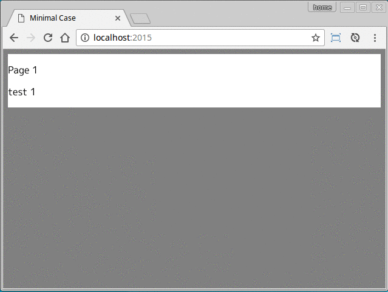

# React Dynamic ViewPager

Switch dynamically page with the mouse or touch operation.



## Usage

minimal case.

```javascript
import React from 'react';
import { render } from 'react-dom';
import ViewPager from 'react-dynamic-viewpager';

function Page(props) {
  const { index, data } = props;
  return (
    <div>
      <p>Page {index+1}</p>
      <p>{data}</p>
    </div>
  );
}

const data = [
  'test 1',
  'test 2',
  'test 3',
  'test 4',
  'test 5'
];

render(
  <ViewPager data={data}>
    <Page />
  </ViewPager>,
  document.getElementById('app')
);
```

## Props

| Name | Type | Default | Description |
| --- | --- | --- | --- |
| data **(required)** | array | |List of page data. |
| index | number | 0 | The index of the current page. |
| onChange | function | | A callback fired when the page index has been changed. <br /> ``` (newIndex, oldIndex) => {} ``` |
